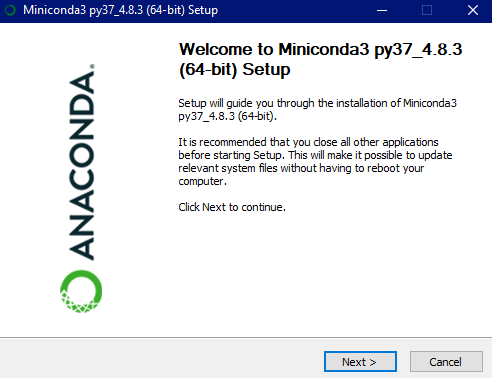
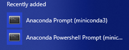
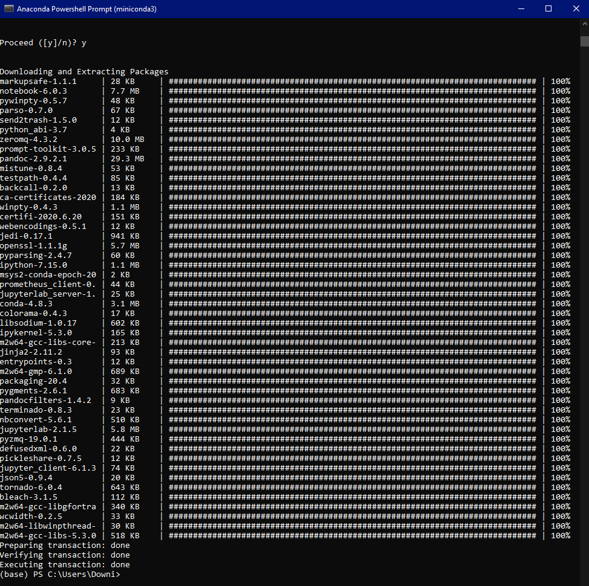
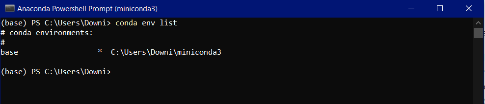
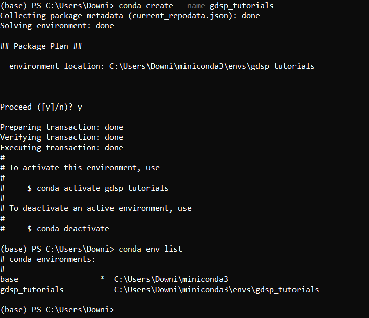
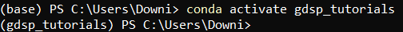

# Tutorial 1 - Getting Started with Python
Welcome to the first part of the course, this tutorial will lay the groundwork for everything we do going forward. In this lesson we're going to cover following . . .
 - Installing Python through Anaconda
 - Jupyter Lab / Jupyter Notebooks (and Spyder)
 - Setting up Virtual Environments
 

 ## Installing Python through Anaconda
 If you're completely new to Python, you might be wanting to know "Why aren't we just going to www.python.org and installing the latest version of Python?" and that would be a fair question. That is certainly a viable option but for the purposes of this course we're going to make use of a distribution of Python called Anaconda. A distribution is a collection of software that are quick and easy to install and is ready to go out-of-the-box. This is what makes Anaconda a convenient option when working with Python.

 Anaconda is one of the most (if not the most) popular distributions of Python for data science purposes. Installing Anaconda will get you access to Python and many very useful data science libraries right out-of-the-box (i.e. matplotlib, numpy, scipy, etc). You can go to https://www.anaconda.com/products/individual and scroll to the bottom of the page to download Anaconda for your system (be it Windows, MacOS, or Linux). At the time of writing this tutorial, the installers available are for Python 3.7 and 2.7, we will be downloading the 3.7 version. **DO NOT DOWNLOAD THIS LINK, *YET***. 
 
 Sorry for the strong wording there but it was important to grab your attention before you jumped too far ahead. If you want to download from the aforementioned link, that is perfectly fine but be aware that this is going to be a very large download (at least a few gigabytes). The advantage of downloading the full Anaconda distribution is you get a ton of built in libraries, Anaconda Navigator (which provides a nice graphical interface for installing packages and tinkering with virtual environments), Jupyter, and Spyder. On your personal machine this is a great option, unfortunately when you move to the cluster you lose these niceties and are required to work from the command line. The alternative to the full fat Anaconda is called Miniconda, which only includes conda (the library/package distribution system for Anaconda), Python, and a few useful packages like pip (the base Python package manager). This tutorial is going to take the conservative route and step you through installation of Miniconda. This will hopefully make the transition to the cluster environment easier for you in the future.

 To install miniconda go to https://docs.conda.io/en/latest/miniconda.html and find the Python 3.7 version for your OS. Miniconda is only roughly 55 megabytes, so it's not a tiny download but should be much more manageable on whatever network you're on then a multi-gigabyte download. When it is finished downloading open the file you downloaded and you should see something like the following image.



Work your way through the installation process and let it install miniconda into the default location, for me on windows it is *C:\Users\USERNAME\miniconda3*. Accept the defaults and install miniconda. **If you already have Python on your system, you may want to uncheck the box that says *Register Anaconda as my default Python 3.7*.**

Congrats! You've got Python and the conda package manager installed! To interact with Anaconda you'll need to run the Anaconda prompt. Below I've included an image of what you'll see on Windows below. The Anaconda prompt is how you'll interact with Anaconda, more on that in a minute.



Now, we're going to need our Python editors, i.e. Jupyter or Spyder. We'll cover this in the next section.

One quick aside before going on, if you're curious about using anaconda navigator still (the GUI that was mentioned previously) you can still get that with Miniconda. Open your Anaconda Prompt and run the following command ```conda install anaconda-navigator```. This will install various components required for setting up Anaconda Navigator which will give you a GUI way of handling launching Jupyter and Spyder as well as handling virtual environments. We won't be using navigator going forward but feel free to make use of it!

## Jupyter Lab / Jupyter Notebooks and Spyder
In this section we'll cover the setup of our code editor environments, Jupyter or Spyder. We'll primarily use Jupyter in these tutorials but both are excellent tools and how to install both tools will be covered here.

To get started installing Jupyter Lab and Jupyter Notebook, open your Anconda Prompt and run *conda install -c conda-forge jupyterlab*. You'll be prompted about whether you want to proceed or not, enter *y* and let the installer proceed. Various packages necessary to use Jupyter Lab will be installed, this shouldn't take too long. You're prompt should look something like below.



Once the installation has been completed, also run *conda install -c conda-forge notebook*. 

Finally, let's get Spyder set up. If you're familiar with R and R Studio, you'll very likely enjoy Spyder. It is intended to be a very similar to the experience one has in R Studio. It's not nearly as refined in my opinion but it is a great tool. Run *conda install -c anaconda spyder* in your Anaconda prompt.

Now if you want to open any of these programs, you can either open them from your start menu, application launcher, or from the Anaconda prompt. You can open any of these code editors from your Anaconda Prompt by running the following commands in the list below. If you want to quit jupyter (lab or notebook) just close the web browser page that has been opened and use ctrl+c or cmd+c in your prompt to quit.

 - ```jupyter lab```
 - ```jupyter notebook```
 - ```spyder```

## Setting up Virtual Environments
Time for the final portion of this section, virtual environments! What are virtual environments? Virtual environments are essential to ensuring that your work is reproducible (one of the cornerstones of good scientific work) as they provide a sort of version control for the libraries you choose to use in your project. If you're still struggling to grasp what a virtual environment is, let's set up an example.

Suppose you start a project where you are using the Pandas library for putting your data into dataframes (basically excel sheets), the year is 2017. You're using some functions built into Pandas to do your analysis like group by to group data elements together. Things are working quite well in 2017, hooray! Fast forward to 2020 and you need to revisit your work so you download the repository from your GitHub account or grab the project from your cloud storage option of choice. You install Pandas to run the project from 2017 but suddenly things aren't working like you remembered, the group by operations are now acting very strange but of course you don't know that at first because the errors are in the results and not actually causing the code to fail. What gives? Well, in the 3 years that have gone by since you worked on this project, Pandas has updated a few versions and the group by function has changed enough so that the way you used it back in 2017 is no longer valid. If you had set up a virtual environment you could have saved that information along with the project so that in 2020, you would be able to start that virtual environment back up and have the exact Pandas version you used back in 2017 ensuring that your code would perform identically!

Is the picture getting clearer? I hope so, if not don't hesitate to ask questions! Look around online and see what else you can find. One resource I had come across that may be helpful can be found here: https://realpython.com/python-virtual-environments-a-primer/. Keep in mind, this article here is not showing you how to set up a virtual environment with conda.

Okay, enough chit chat about what virtual environments are, how do you set one up? Let's do this!

Open up your Anaconda prompt like we had done before. Let's see what environments are available at first ```conda env list```. Since you haven't created anything yet, you'll only have the base directory, you should see something like the image below.



Let's create an environment for the work we're going to do going forward. Creating an environment is as simple as ```conda create --name MY_ENVIRONMENT_NAME```. You can fill in whatever name you would like here but for our purposes I'd recommend naming it the same as what I'm naming it, *gdsp_tutorials*. Afterward, when we list out the environments you should see it like below. In this screenshot I've included what the output of setting up an environment looks like.



Now to switch to this environment and start installing packages simply run ```conda activate gdsp_tutorials```. To leave that environment you can run ```conda deactivate```, since only one environment is active at a time, you don't have to specify which environment you're deactivating. When you activate the environment, you'll notice that in front of the current line in your terminal, you'll have the environment name in parenthesis like what is shown below.



If you want to do some more reading on managing your anaconda environments, check out the following resource: https://docs.conda.io/projects/conda/en/latest/user-guide/tasks/manage-environments.html.

## Final Notes
I realize that I'm leaving off the very reason that we set up a virtual environment, installing packages. We'll get there but let's cover some of the basics before we get too far ahead of ourselves. In the next Tutorial, *Tutorial 2: Python Basics*, we'll cover the basics of the Python language and how to install packages.